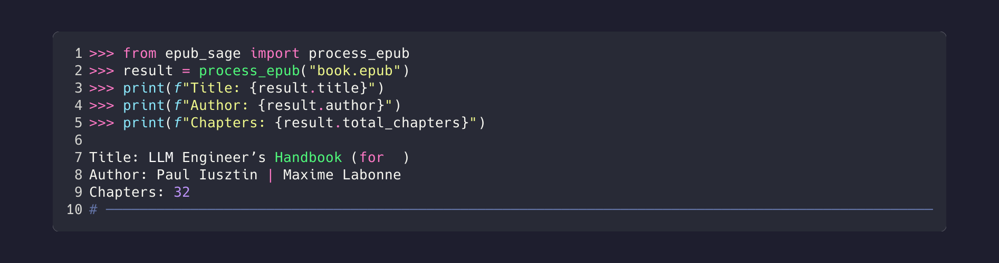
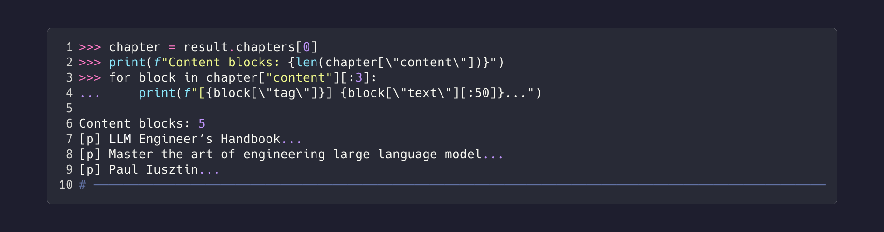
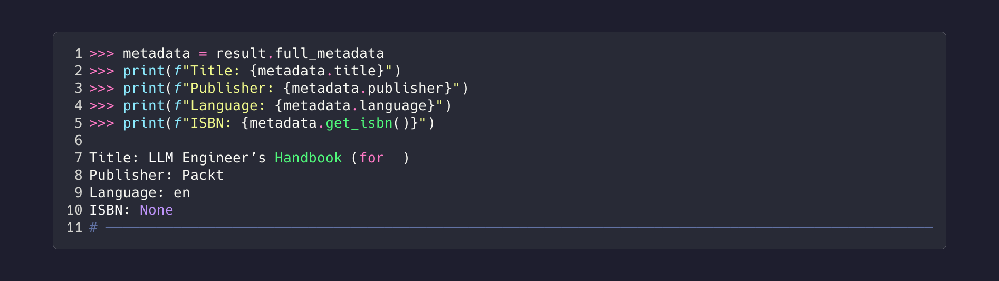
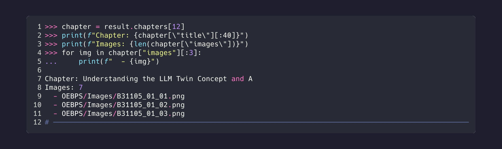

# EpubSage API Reference

Complete Python API documentation for EpubSage.

## Quick Reference

```python
from epub_sage import process_epub

result = process_epub("book.epub")
print(result.title)
print(result.chapters)
```



---

## High-Level Functions

### process_epub

Main function for processing EPUB files.

```python
from epub_sage import process_epub

result = process_epub(path: str) -> SimpleEpubResult
```

**Parameters:**
- `path` (str): Path to EPUB file

**Returns:** `SimpleEpubResult` object

**Example:**
```python
result = process_epub("book.epub")

if result.success:
    print(f"Title: {result.title}")
    print(f"Chapters: {result.total_chapters}")
else:
    print(f"Errors: {result.errors}")
```

---

### quick_extract

Extract EPUB to a directory without processing.

```python
from epub_sage import quick_extract

path = quick_extract(epub_path: str) -> str
```

**Parameters:**
- `epub_path` (str): Path to EPUB file

**Returns:** Path to extracted directory

**Example:**
```python
extracted_dir = quick_extract("book.epub")
print(f"Extracted to: {extracted_dir}")
```

---

### get_epub_info

Get file information without full extraction.

```python
from epub_sage import get_epub_info

info = get_epub_info(path: str) -> dict
```

**Parameters:**
- `path` (str): Path to EPUB file

**Returns:** Dictionary with file info

**Example:**
```python
info = get_epub_info("book.epub")
print(f"Size: {info['size']}")
print(f"Files: {info['file_count']}")
```

---

### parse_content_opf

Parse content.opf file directly.

```python
from epub_sage import parse_content_opf

result = parse_content_opf(path: str) -> ParsedContentOpf
```

**Parameters:**
- `path` (str): Path to EPUB or OPF file

**Returns:** `ParsedContentOpf` object

---

### save_to_json

Save data to JSON with datetime support.

```python
from epub_sage import save_to_json

save_to_json(data: dict, path: str) -> None
```

**Parameters:**
- `data` (dict): Data to save
- `path` (str): Output file path

**Example:**
```python
result = process_epub("book.epub")
save_to_json({"title": result.title, "chapters": result.chapters}, "output.json")
```

---

## Data Models

### SimpleEpubResult

Main result object returned by `process_epub()`.


#### Fields

| Field | Type | Description |
|-------|------|-------------|
| `title` | `str` | Book title |
| `author` | `str` | Primary author |
| `publisher` | `str` | Publisher name |
| `language` | `str` | Language code (e.g., "en") |
| `description` | `str` | Book description |
| `isbn` | `str` | ISBN identifier |
| `publication_date` | `str` | Publication date |
| `chapters` | `list[dict]` | List of chapter dictionaries |
| `total_chapters` | `int` | Number of chapters |
| `total_words` | `int` | Total word count |
| `estimated_reading_time` | `dict` | `{'hours': N, 'minutes': N}` |
| `success` | `bool` | Processing status |
| `errors` | `list[str]` | Error messages if any |
| `full_metadata` | `DublinCoreMetadata` | Complete metadata object |

#### Example

```python
result = process_epub("book.epub")

print(f"Title: {result.title}")
print(f"Author: {result.author}")
print(f"Words: {result.total_words:,}")
print(f"Reading time: {result.estimated_reading_time}")
```


---

### Chapter Dictionary

Each chapter in `result.chapters` contains:


#### Fields

| Field | Type | Description |
|-------|------|-------------|
| `chapter_id` | `int` | Sequential chapter ID (0-based) |
| `title` | `str` | Chapter title |
| `href` | `str` | Path to HTML file within EPUB |
| `word_count` | `int` | Word count for this chapter |
| `content` | `list[dict]` | List of content blocks |
| `sections` | `list[dict]` | TOC-based sections with hierarchy |
| `images` | `list[str]` | Image paths referenced in chapter |
| `content_type` | `str` | Type: `chapter`, `front_matter`, `back_matter`, `part` |
| `chapter_number` | `int \| None` | Extracted chapter number |
| `part_number` | `int \| None` | Part number if applicable |
| `section_number` | `int \| None` | Section number |
| `level` | `int` | Hierarchy depth (1 = top level) |
| `linear` | `bool` | Whether in main reading flow |

#### Example

```python
for chapter in result.chapters:
    print(f"{chapter['chapter_id']}: {chapter['title']}")
    print(f"  Type: {chapter['content_type']}")
    print(f"  Words: {chapter['word_count']}")
    print(f"  Images: {len(chapter['images'])}")
```

---

### Content Block Dictionary

Each block in `chapter['content']` contains:



#### Fields

| Field | Type | Description |
|-------|------|-------------|
| `tag` | `str` | HTML tag name (h1, p, section, etc.) |
| `text` | `str` | Plain text content |
| `html` | `str` | Original HTML markup |
| `images` | `list[str]` | Images within this block |
| `is_header` | `bool` | Whether this is a header element |

#### Example

```python
chapter = result.chapters[0]

for block in chapter['content']:
    if block['is_header']:
        print(f"## {block['text']}")
    else:
        print(block['text'][:100])

    if block['images']:
        print(f"  Images: {block['images']}")
```

---

### Section Dictionary

Each section in `chapter['sections']` contains TOC-based content with nested subsections matching the TOC tree structure:

#### Fields

| Field | Type | Description |
|-------|------|-------------|
| `id` | `str` | Section anchor ID from TOC |
| `title` | `str` | Section title from TOC |
| `level` | `int` | Hierarchy depth (1 = top level, 2 = subsection, etc.) |
| `content` | `list[dict]` | Content blocks for this section |
| `images` | `list[str]` | Images in this section |
| `word_count` | `int` | Word count for section |
| `subsections` | `list[dict]` | Nested child sections (same structure, recursive) |

#### Example

```python
def print_section(section, indent=0):
    prefix = "  " * indent
    print(f"{prefix}{section['title']} ({section['word_count']} words)")
    for sub in section['subsections']:
        print_section(sub, indent + 1)

for chapter in result.chapters:
    print(f"Chapter: {chapter['title']}")
    for section in chapter['sections']:
        print_section(section, indent=1)
```

**Note:** Sections are nested recursively via `subsections`, matching the TOC tree hierarchy exactly.

---

### DublinCoreMetadata

Complete Dublin Core metadata model.



#### Fields

| Field | Type | Description |
|-------|------|-------------|
| `title` | `str` | Book title |
| `creators` | `list[DublinCoreCreator]` | Author objects |
| `publisher` | `str` | Publisher name |
| `language` | `str` | ISO language code |
| `description` | `str` | Book description |
| `identifiers` | `list[DublinCoreIdentifier]` | ISBN, UUID, etc. |
| `dates` | `list[DublinCoreDate]` | Publication dates |
| `subjects` | `list[DublinCoreSubject]` | Subject/category tags |
| `rights` | `str` | Copyright information |
| `epub_version` | `str` | EPUB version (2.0, 3.0) |

#### Methods

| Method | Returns | Description |
|--------|---------|-------------|
| `get_primary_author()` | `str` | First author name |
| `get_isbn()` | `str \| None` | ISBN if available |
| `get_publication_date()` | `datetime \| None` | Parsed publication date |

#### Example

```python
metadata = result.full_metadata

print(f"Title: {metadata.title}")
print(f"Author: {metadata.get_primary_author()}")
print(f"ISBN: {metadata.get_isbn()}")
print(f"Published: {metadata.get_publication_date()}")

for creator in metadata.creators:
    print(f"  {creator.name} ({creator.role})")
```

---

### EpubStructure

Complete EPUB structure analysis.

#### Fields

| Field | Type | Description |
|-------|------|-------------|
| `chapters` | `list[StructureItem]` | Classified chapters |
| `parts` | `list[StructureItem]` | Book parts |
| `front_matter` | `list[StructureItem]` | Front matter items |
| `back_matter` | `list[StructureItem]` | Back matter items |
| `images` | `list[ImageItem]` | All images |
| `navigation_tree` | `list[NavigationPoint]` | TOC hierarchy |
| `reading_order` | `list[str]` | Spine order |
| `organization` | `ContentOrganization` | Summary stats |

---

## Classes

### SimpleEpubProcessor

Main processing class for full control.

```python
from epub_sage import SimpleEpubProcessor

processor = SimpleEpubProcessor(temp_dir: str = None)
```

#### Methods

| Method | Description |
|--------|-------------|
| `process_epub(path, cleanup=True)` | Full pipeline: extract, parse, return result |
| `process_directory(path)` | Process already-extracted EPUB |
| `quick_info(path)` | Return metadata only, minimal processing |

#### Example

```python
processor = SimpleEpubProcessor(temp_dir="/tmp/epub_work")

# Process EPUB file
result = processor.process_epub("book.epub", cleanup=True)

# Or process extracted directory
result = processor.process_directory("/path/to/extracted/")
```

---

### EpubExtractor

Low-level ZIP handling and file management.

```python
from epub_sage import EpubExtractor

extractor = EpubExtractor(base_dir: str = None)
```

#### Methods

| Method | Description |
|--------|-------------|
| `extract_epub(path)` | Extract ZIP to managed directory |
| `get_epub_info(path)` | File stats without extraction |
| `find_content_opf(dir)` | Locate content.opf in extracted tree |
| `validate_epub_structure(path)` | Check EPUB spec compliance |
| `cleanup_extraction(dir)` | Delete extracted files |

#### Example

```python
extractor = EpubExtractor(base_dir="/tmp/epubs")

# Extract
extracted_path = extractor.extract_epub("book.epub")

# Find OPF
opf_path = extractor.find_content_opf(extracted_path)

# Cleanup when done
extractor.cleanup_extraction(extracted_path)
```

---

### DublinCoreParser

Parse content.opf files for metadata.

```python
from epub_sage import DublinCoreParser

parser = DublinCoreParser()
```

#### Methods

| Method | Description |
|--------|-------------|
| `parse_file(path)` | Parse OPF file, returns `ParsedContentOpf` |

#### Example

```python
parser = DublinCoreParser()
result = parser.parse_file("/path/to/content.opf")

print(result.metadata.title)
print(result.metadata.get_primary_author())
print(result.manifest)  # All manifest items
print(result.spine)     # Reading order
```

---

### EpubStructureParser

Analyze complete EPUB structure.

```python
from epub_sage import EpubStructureParser

parser = EpubStructureParser()
```

#### Methods

| Method | Description |
|--------|-------------|
| `parse_complete_structure(opf_result, epub_dir)` | Full structure analysis |
| `extract_content_by_toc(epub_dir, structure)` | Extract content using TOC boundaries |

#### Example

```python
from epub_sage import DublinCoreParser, EpubStructureParser

# First parse OPF
dc_parser = DublinCoreParser()
opf_result = dc_parser.parse_file(opf_path)

# Then analyze structure
struct_parser = EpubStructureParser()
structure = struct_parser.parse_complete_structure(opf_result, epub_dir)

print(f"Chapters: {len(structure.chapters)}")
print(f"Front Matter: {len(structure.front_matter)}")
print(f"Back Matter: {len(structure.back_matter)}")
print(f"Images: {len(structure.images)}")
print(f"Parts: {len(structure.parts)}")
```

#### TOC-Based Extraction

Extract content using Table of Contents anchor boundaries for precise section splitting.

```python
# After parsing structure
extracted = struct_parser.extract_content_by_toc(epub_dir, structure)

# Returns: Dict[file_path, List[ExtractedSection]]
for file_path, sections in extracted.items():
    for section in sections:
        print(f"{section.nav_point.label}: {section.text_length} chars")
        print(f"  Blocks: {len(section.content_blocks)}")
        print(f"  Images: {section.images}")
```

---

### ExtractedSection

Dataclass for content extracted from a single TOC section.

```python
from epub_sage.extractors import ExtractedSection
```

#### Fields

| Field | Type | Description |
|-------|------|-------------|
| `nav_point` | `NavigationPoint` | The TOC entry this section belongs to |
| `content_blocks` | `list[dict]` | Content blocks between anchors |
| `images` | `list[str]` | Image paths in this section |
| `text_length` | `int` | Total character count |

---

### SectionBoundary

Dataclass defining content boundaries for TOC sections.

```python
from epub_sage.extractors import SectionBoundary
```

#### Fields

| Field | Type | Description |
|-------|------|-------------|
| `start_anchor` | `str \| None` | Starting element ID |
| `end_anchor` | `str \| None` | Ending element ID |
| `nav_point` | `NavigationPoint` | Associated navigation point |

---

### NavigationPoint (Updated)

Navigation entry from TOC with anchor parsing.

#### New Fields

| Field | Type | Description |
|-------|------|-------------|
| `file_path` | `str \| None` | File path without anchor (e.g., `OEBPS/Text/ch01.xhtml`) |
| `anchor` | `str \| None` | Anchor ID from href (e.g., `p12` from `#p12`) |

---

### TOC Extraction Functions

```python
from epub_sage.extractors import build_section_boundaries, extract_book_by_toc
```

| Function | Description |
|----------|-------------|
| `build_section_boundaries(nav_points)` | Group nav_points by file and compute boundaries |
| `extract_book_by_toc(epub_dir, nav_points)` | Extract entire book using TOC structure |

---

### SearchService

Full-text search across chapters.

```python
from epub_sage import SearchService

search = SearchService()
```

#### Methods

| Method | Description |
|--------|-------------|
| `search(chapters, query, **options)` | Search chapters for query |

#### Options

| Option | Type | Description |
|--------|------|-------------|
| `limit` | `int` | Maximum results |
| `context` | `int` | Characters of context |
| `case_sensitive` | `bool` | Case-sensitive search |

#### Example

```python
from epub_sage import process_epub, SearchService

result = process_epub("book.epub")
search = SearchService()

matches = search.search(result.chapters, "machine learning", limit=10)

for match in matches:
    print(f"Chapter {match.chapter_id}: {match.title}")
    print(f"  Context: {match.context}")
```

---

### DublinCoreService

High-level service for metadata extraction.

```python
from epub_sage import create_service

service = create_service()
```

#### Methods

| Method | Description |
|--------|-------------|
| `parse_content_opf(path)` | Parse EPUB or OPF file |
| `extract_basic_metadata(path)` | Get basic metadata dict |
| `parse_complete_structure(path)` | Full structure analysis |
| `get_chapter_outline(path)` | Chapter outline |
| `get_image_distribution(path)` | Image statistics |
| `validate_content_opf(path)` | Validate structure |

#### Example

```python
from epub_sage import create_service

service = create_service()

# Works with .epub files directly
metadata = service.extract_basic_metadata("book.epub")
print(f"Title: {metadata['title']}")
print(f"Author: {metadata['author']}")
```

---

## Content Types

The `content_type` field uses these values:

| Type | Description |
|------|-------------|
| `chapter` | Main content chapter |
| `front_matter` | Preface, foreword, introduction, etc. |
| `back_matter` | Appendix, index, bibliography, etc. |
| `part` | Book part divider |
| `cover` | Cover page |
| `toc` | Table of contents |
| `nav` | Navigation document |

---

## Image Handling

Images are validated and resolved to EPUB-relative paths.



```python
result = process_epub("book.epub")

for chapter in result.chapters:
    if chapter['images']:
        print(f"Chapter: {chapter['title']}")
        for img_path in chapter['images']:
            print(f"  {img_path}")
            # Path like: OEBPS/images/figure1.png
```

---

## Error Handling

```python
result = process_epub("book.epub")

if not result.success:
    for error in result.errors:
        print(f"Error: {error}")
```

### Common Errors

| Error | Cause |
|-------|-------|
| `File not found` | Invalid EPUB path |
| `Invalid ZIP/EPUB file` | Corrupted or non-EPUB file |
| `No content.opf file found` | Missing required metadata file |
| `Content extraction error` | HTML parsing issue |

---

## Type Hints

All functions and classes are fully typed:

```python
from epub_sage import (
    process_epub,
    SimpleEpubResult,
    DublinCoreMetadata,
    EpubStructure,
    StructureItem,
    ImageItem,
    ContentType
)
```

---

## See Also

- [README](../README.md) - Quick start guide
- [CLI Reference](CLI.md) - Command-line documentation
- [Examples](EXAMPLES.md) - Real-world use cases
