# EpubSage CLI Reference

Complete command-line interface documentation for EpubSage.

## Overview

EpubSage provides 13 commands for complete EPUB analysis without writing code.

```bash
epub-sage --help
```

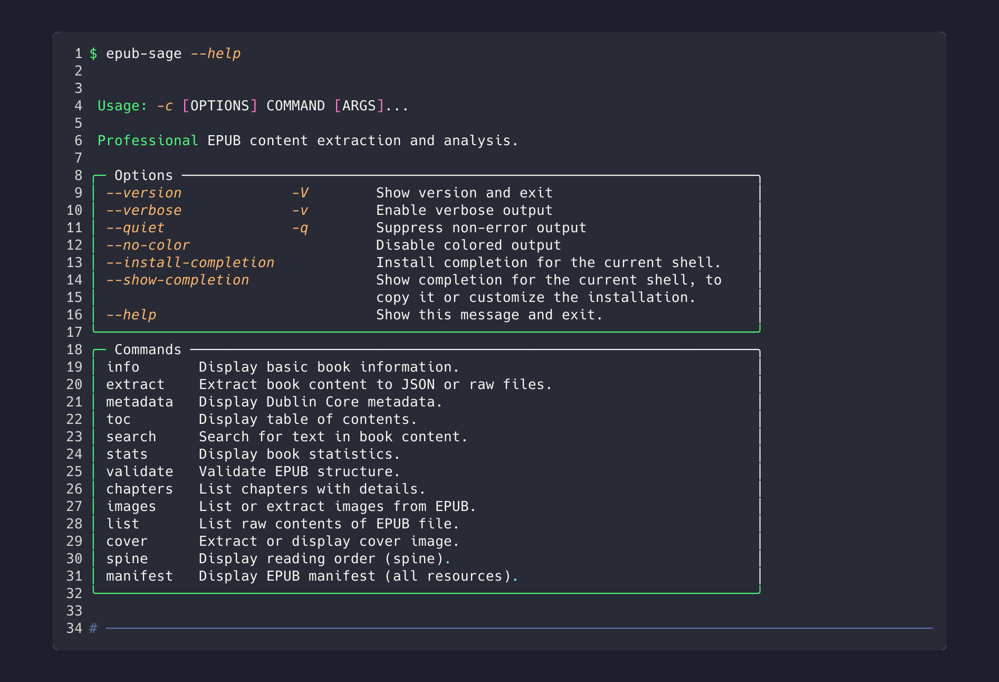

## Global Options

| Option | Description |
|--------|-------------|
| `--version`, `-V` | Show version and exit |
| `--verbose`, `-v` | Enable verbose output |
| `--quiet`, `-q` | Suppress non-error output |
| `--no-color` | Disable colored output |
| `--help` | Show help message |

---

## Commands

| Command | Description |
|---------|-------------|
| [`info`](#info) | Display basic book information |
| [`stats`](#stats) | Display detailed statistics |
| [`chapters`](#chapters) | List chapters with word counts and images |
| [`metadata`](#metadata) | Display Dublin Core metadata |
| [`toc`](#toc) | Display table of contents |
| [`images`](#images) | Show image distribution |
| [`search`](#search) | Search for text in book content |
| [`validate`](#validate) | Validate EPUB structure |
| [`spine`](#spine) | Display reading order |
| [`manifest`](#manifest) | Display all EPUB resources |
| [`extract`](#extract) | Extract content to JSON or raw files |
| [`list`](#list) | List raw EPUB contents |
| [`cover`](#cover) | Extract or display cover image |

---

## info

Display basic book information at a glance.

### Usage

```bash
epub-sage info <EPUB_FILE>
```

### Example

```bash
epub-sage info book.epub
```

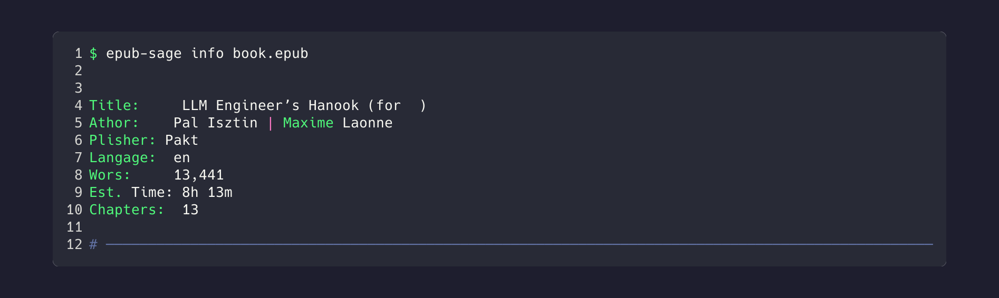

### Output Fields

- **Title** - Book title
- **Author** - Primary author
- **Publisher** - Publisher name
- **Language** - Language code
- **Words** - Total word count
- **Est. Time** - Estimated reading time
- **Chapters** - Number of chapters

---

## stats

Display comprehensive reading statistics.

### Usage

```bash
epub-sage stats <EPUB_FILE>
```

### Example

```bash
epub-sage stats book.epub
```

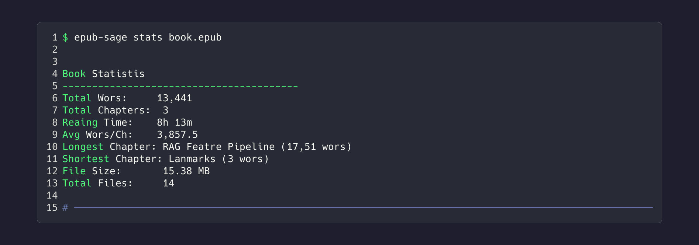

### Output Fields

- Word count breakdown
- Reading time estimates
- Chapter statistics
- Image counts

---

## chapters

List all chapters with detailed information.

### Usage

```bash
epub-sage chapters <EPUB_FILE> [OPTIONS]
```

### Options

| Option | Description |
|--------|-------------|
| `--format` | Output format (table, json, csv) |

### Example

```bash
epub-sage chapters book.epub
```

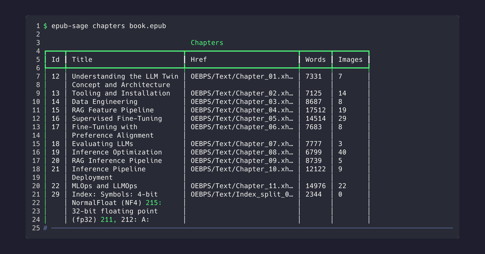

### Output Fields

- **#** - Chapter ID
- **Title** - Chapter title
- **Words** - Word count
- **Images** - Number of images
- **Type** - Content type (chapter, front_matter, etc.)

---

## metadata

Extract complete Dublin Core metadata.

### Usage

```bash
epub-sage metadata <EPUB_FILE> [OPTIONS]
```

### Options

| Option | Description |
|--------|-------------|
| `--format` | Output format (table, json) |

### Example

```bash
epub-sage metadata book.epub
```

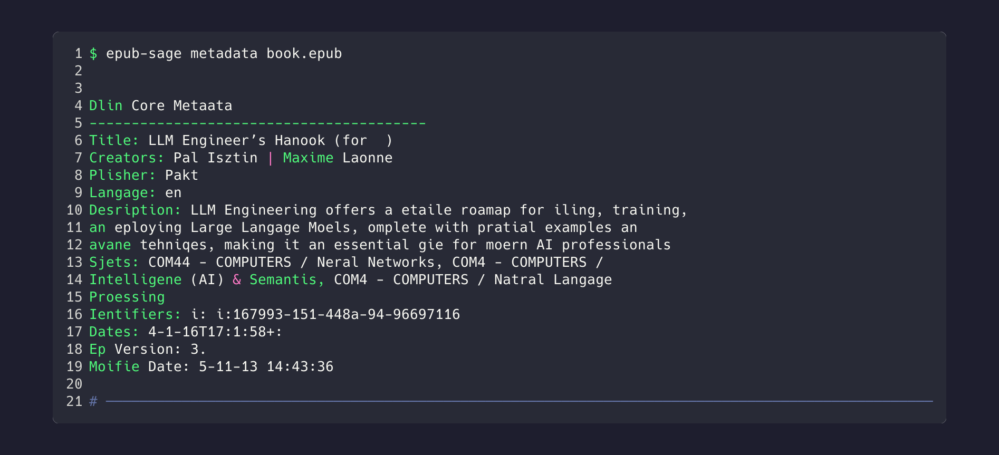

### Output Fields

All Dublin Core metadata fields:
- Title, Creator, Publisher
- Language, Description
- Identifiers (ISBN, UUID)
- Dates, Rights, Subject

---

## toc

Display the table of contents / navigation structure.

### Usage

```bash
epub-sage toc <EPUB_FILE> [OPTIONS]
```

### Options

| Option | Description |
|--------|-------------|
| `--depth` | Maximum depth to display |
| `--format` | Output format (tree, flat, json) |

### Example

```bash
epub-sage toc book.epub
```


### Output

Hierarchical navigation structure with:
- Section titles
- Nesting levels
- File references

---

## images

Show image distribution across the book.

### Usage

```bash
epub-sage images <EPUB_FILE> [OPTIONS]
```

### Options

| Option | Description |
|--------|-------------|
| `--list` | List all image paths |
| `--format` | Output format (table, json) |

### Example

```bash
epub-sage images book.epub
```

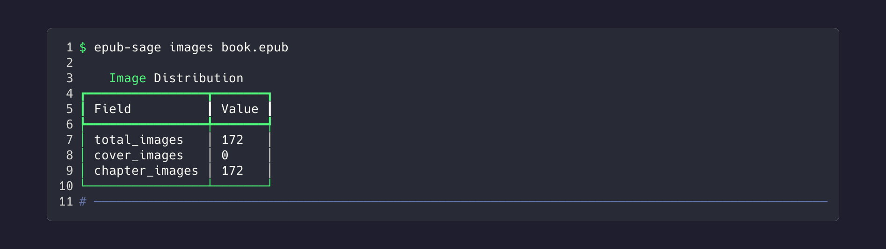

### Output Fields

- **total_images** - Total image count
- **cover_images** - Cover image count
- **chapter_images** - Images in chapters

---

## search

Search for text across all book content.

### Usage

```bash
epub-sage search <EPUB_FILE> <QUERY> [OPTIONS]
```

### Options

| Option | Description |
|--------|-------------|
| `--limit` | Maximum results to return |
| `--context` | Characters of context around match |
| `--case-sensitive` | Enable case-sensitive search |

### Example

```bash
epub-sage search book.epub "machine learning"
```

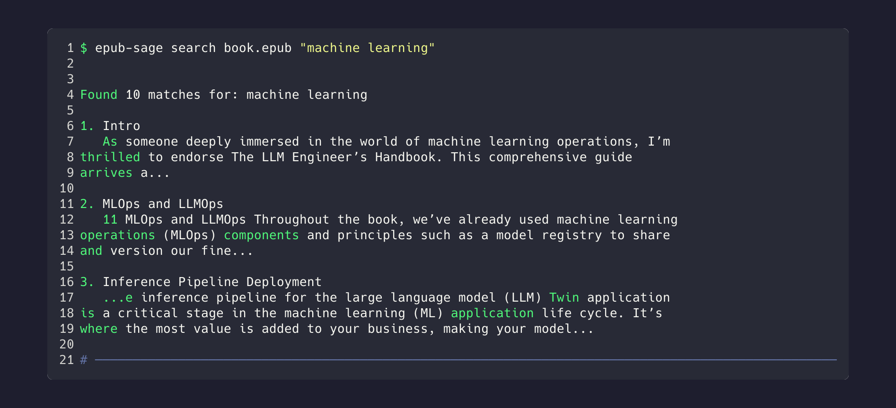

### Output

- Chapter where match was found
- Context around the match
- Match highlighting

---

## validate

Validate EPUB structure and metadata quality.

### Usage

```bash
epub-sage validate <EPUB_FILE> [OPTIONS]
```

### Options

| Option | Description |
|--------|-------------|
| `--strict` | Enable strict validation |
| `--format` | Output format (table, json) |

### Example

```bash
epub-sage validate book.epub
```

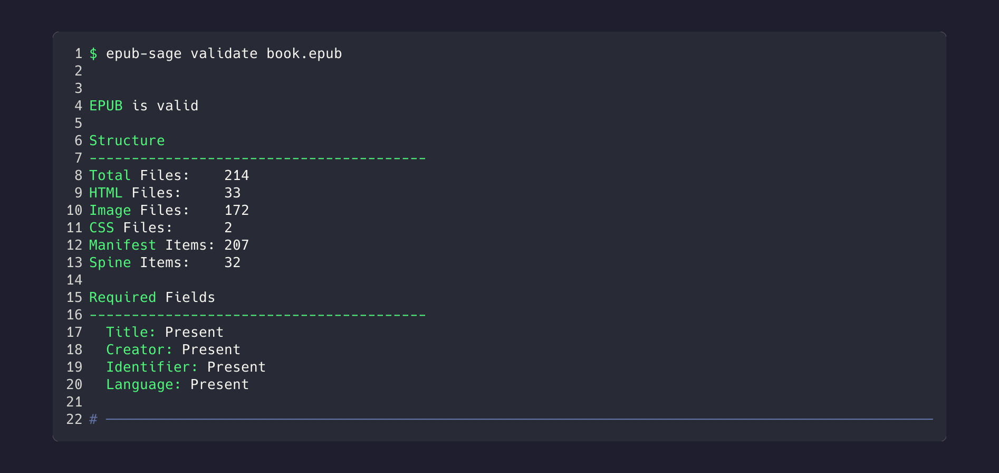

### Output

- Validation status
- Required fields check
- Quality score
- Warnings and errors

---

## spine

Display the reading order (spine) of the book.

### Usage

```bash
epub-sage spine <EPUB_FILE> [OPTIONS]
```

### Options

| Option | Description |
|--------|-------------|
| `--format` | Output format (table, json) |

### Example

```bash
epub-sage spine book.epub
```

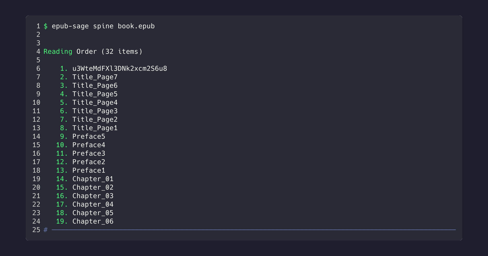

### Output Fields

- **#** - Order in spine
- **ID** - Item ID reference
- **Href** - File path
- **Linear** - In reading flow (yes/no)

---

## manifest

Display all resources in the EPUB manifest.

### Usage

```bash
epub-sage manifest <EPUB_FILE> [OPTIONS]
```

### Options

| Option | Description |
|--------|-------------|
| `--type` | Filter by media type |
| `--format` | Output format (table, json) |

### Example

```bash
epub-sage manifest book.epub
```

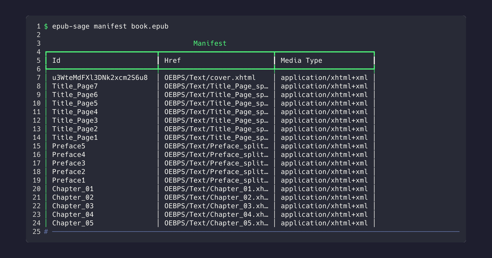

### Output Fields

- **ID** - Resource ID
- **Href** - File path
- **Type** - Media type
- **Properties** - EPUB properties

---

## extract

Extract book content to JSON or raw files.

### Usage

```bash
epub-sage extract <EPUB_FILE> [OPTIONS]
```

### Options

| Option | Description |
|--------|-------------|
| `-o`, `--output` | Output file path |
| `--format` | Output format (json, raw) |
| `--pretty` | Pretty print JSON |

### Example

```bash
epub-sage extract book.epub -o output.json
```


### Output

JSON file containing:
- Complete metadata
- All chapters with content
- Image references
- Word counts and statistics

---

## list

List raw contents of the EPUB file (ZIP entries).

### Usage

```bash
epub-sage list <EPUB_FILE> [OPTIONS]
```

### Options

| Option | Description |
|--------|-------------|
| `--type` | Filter by file type |

### Example

```bash
epub-sage list book.epub
```

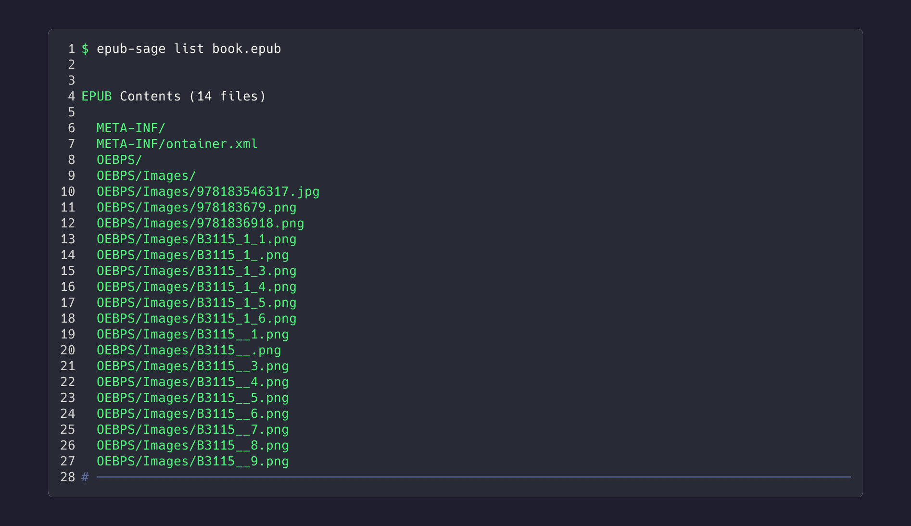

### Output

- File paths within EPUB
- File sizes
- Compression info

---

## cover

Extract or display the cover image.

### Usage

```bash
epub-sage cover <EPUB_FILE> [OPTIONS]
```

### Options

| Option | Description |
|--------|-------------|
| `-o`, `--output` | Save cover to file |
| `--info` | Show cover info only |

### Example

```bash
# Display cover info
epub-sage cover book.epub

# Extract cover image
epub-sage cover book.epub -o cover.jpg
```


### Output

- Cover image path
- Dimensions (if available)
- Media type

---

## Examples

### Batch Processing

```bash
# Process multiple EPUBs
for file in *.epub; do
  epub-sage info "$file"
done
```

### Export to JSON

```bash
# Extract and process with jq
epub-sage extract book.epub -o - | jq '.chapters[].title'
```

### Search Multiple Books

```bash
# Search across library
for file in ~/Books/*.epub; do
  echo "=== $file ==="
  epub-sage search "$file" "python" --limit 3
done
```

### Validation Pipeline

```bash
# Validate all EPUBs in directory
for file in *.epub; do
  if epub-sage validate "$file" --quiet; then
    echo "✓ $file"
  else
    echo "✗ $file"
  fi
done
```

---

## Exit Codes

| Code | Meaning |
|------|---------|
| 0 | Success |
| 1 | General error |
| 2 | File not found |
| 3 | Invalid EPUB |
| 4 | Validation failed |

---

## See Also

- [README](../README.md) - Quick start guide
- [API Reference](API.md) - Python API documentation
- [Examples](EXAMPLES.md) - Real-world use cases
